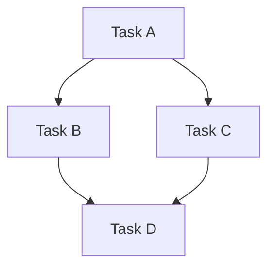

# Task List

## Overview
[Brief summary of implementation phases and priorities]
- **Total Estimated Time**: [Calculate sum of all task estimates]
- **Target Completion**: [Date or timeline]
- **Team Size**: [Number of developers]

## Phase 1: Foundation

### Setup & Configuration
- [ ] [Task description] (Est: Xh, Priority: P0)
- [ ] [Task description] (Est: Xh, Priority: P0)
- [ ] [Task description] (Est: Xh, Priority: P1)

### Core Infrastructure
- [ ] [Task description] (Est: Xh, Priority: P0)
- [ ] [Task description] (Est: Xh, Priority: P0)
- [ ] [Task description] (Est: Xh, Priority: P1)

## Phase 2: Core Features

### [Feature Group 1]
- [ ] [Task description] (Est: Xh, Priority: P0)
- [ ] [Task description] (Est: Xh, Priority: P0)
- [ ] [Task description] (Est: Xh, Priority: P1)

### [Feature Group 2]
- [ ] [Task description] (Est: Xh, Priority: P0)
- [ ] [Task description] (Est: Xh, Priority: P1)

## Phase 3: Integration & Testing

### Integration Tasks
- [ ] [Task description] (Est: Xh, Priority: P0)
- [ ] [Task description] (Est: Xh, Priority: P1)

### Testing Tasks
- [ ] Write unit tests for [component] (Est: Xh, Priority: P0)
- [ ] Write integration tests for [feature] (Est: Xh, Priority: P0)
- [ ] Security testing (Est: Xh, Priority: P0)
- [ ] Performance testing (Est: Xh, Priority: P1)
- [ ] Load testing (Est: Xh, Priority: P1)

### Code Quality
- [ ] Code review and refactoring (Est: Xh, Priority: P1)
- [ ] Static analysis and linting (Est: Xh, Priority: P1)
- [ ] Address technical debt (Est: Xh, Priority: P2)

## Phase 4: Deployment & Documentation

### Deployment Preparation
- [ ] Set up CI/CD pipeline (Est: Xh, Priority: P0)
- [ ] Configure production environment (Est: Xh, Priority: P0)
- [ ] Database migration scripts (Est: Xh, Priority: P0)
- [ ] Monitoring and logging setup (Est: Xh, Priority: P0)

### Documentation
- [ ] API documentation (Est: Xh, Priority: P0)
- [ ] User guide (Est: Xh, Priority: P1)
- [ ] Developer documentation (Est: Xh, Priority: P1)
- [ ] Deployment guide (Est: Xh, Priority: P0)

### UI/UX Polish (if applicable)
- [ ] [Task description] (Est: Xh, Priority: P1)
- [ ] [Task description] (Est: Xh, Priority: P2)

## Task Dependencies

**Dependency List:**
- Task X depends on Task Y being completed first
- Task A must be completed before Task B can start
- Tasks C and D can be done in parallel after Task B

## Critical Path
[Tasks that are on the critical path and will delay project if delayed]
1. [Critical Task 1] → [Critical Task 2] → [Critical Task 3]
2. Estimated critical path duration: [X hours/days]

## Risk Mitigation Tasks
- [ ] [Backup plan task] (Est: Xh, Priority: P1)
- [ ] [Contingency task] (Est: Xh, Priority: P2)
- [ ] [Spike/Research task for risky component] (Est: Xh, Priority: P0)

## Progress Tracking

### Summary
- **Total Tasks**: [Count]
- **Completed**: [Count] ([X%])
- **In Progress**: [Count]
- **Blocked**: [Count]
- **Estimated Remaining Time**: [X hours]

### By Phase
- Phase 1: [X/Y tasks complete] ([X%])
- Phase 2: [X/Y tasks complete] ([X%])
- Phase 3: [X/Y tasks complete] ([X%])
- Phase 4: [X/Y tasks complete] ([X%])

## Notes

### Priority Legend
- **P0 (Must Have)** 🔴: Critical for launch, cannot be delayed
- **P1 (Should Have)** 🟡: Important, include if time permits
- **P2 (Nice to Have)** 🟢: Optional enhancements, can be deferred

### Task Status Icons
- ✅ Completed
- 🚧 In Progress
- ⏸️ Blocked
- ⏭️ Deferred

### Additional Notes
- Review and update estimates after each phase
- Flag blockers immediately